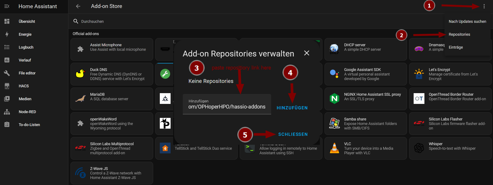
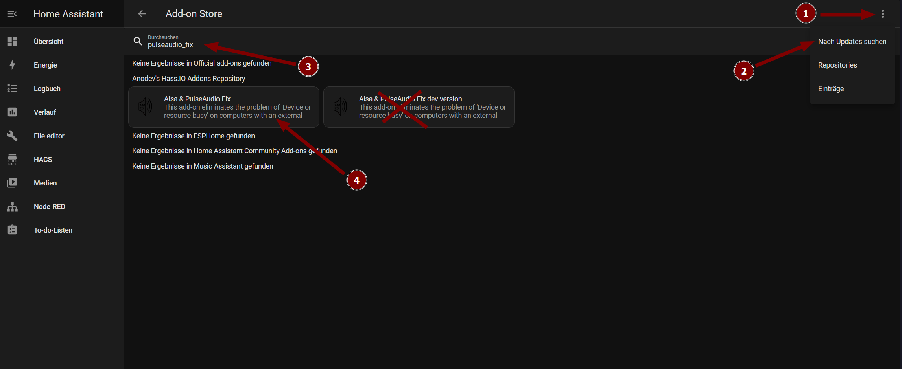

# Homeassistant-Supervised-on-Raspberry-Pi-5
This is a tutorial about the installation of Homeassistant Supervised on your Raspberry Pi 5 running Raspberry Pi OS 64bit.
### If something doesn't work, make sure to check out the Troubleshooting Section at the bottom of this README.

## [Skip the blah](https://github.com/HuckleberryLovesYou/Homeassistant-Supervised-on-Raspberry-Pi-5/blob/main/README.md#kernel-setup)

Didn't find a fix for your Problem? Feel free to open an issue in this repository!

Found something, that wasn't described good or wrong? Feel free to open an issue in this repository!

## Contents
- [Introduction](https://github.com/HuckleberryLovesYou/Homeassistant-Supervised-on-Raspberry-Pi-5?tab=readme-ov-file#introduction)
   - [Why even HA-Supervised?](https://github.com/HuckleberryLovesYou/Homeassistant-Supervised-on-Raspberry-Pi-5?tab=readme-ov-file#first-of-all---why-even-ha-supervised)
   - [Supported or Unsupported](https://github.com/HuckleberryLovesYou/Homeassistant-Supervised-on-Raspberry-Pi-5?tab=readme-ov-file#supported-or-unsupported)
   - [Requirements](https://github.com/HuckleberryLovesYou/Homeassistant-Supervised-on-Raspberry-Pi-5?tab=readme-ov-file#requirements)
- [Installation](https://github.com/HuckleberryLovesYou/Homeassistant-Supervised-on-Raspberry-Pi-5?tab=readme-ov-file#installation)
   - [Automatic Installation](https://github.com/HuckleberryLovesYou/Homeassistant-Supervised-on-Raspberry-Pi-5?tab=readme-ov-file#Automatic-Installation)
   - [kernel setup](https://github.com/HuckleberryLovesYou/Homeassistant-Supervised-on-Raspberry-Pi-5?tab=readme-ov-file#kernel-setup)
   - [Making your system ready to run Homeassistant](https://github.com/HuckleberryLovesYou/Homeassistant-Supervised-on-Raspberry-Pi-5?tab=readme-ov-file#making-your-system-ready-to-run-homeassistant)
      - [Installation of docker and docker-compose](https://github.com/HuckleberryLovesYou/Homeassistant-Supervised-on-Raspberry-Pi-5?tab=readme-ov-file#installation-of-docker-and-docker-compose)
      - [Installation of Homeassistant dependencies](https://github.com/HuckleberryLovesYou/Homeassistant-Supervised-on-Raspberry-Pi-5?tab=readme-ov-file#installation-of-homeassistant-dependencies)
      - [Download os-agent](https://github.com/HuckleberryLovesYou/Homeassistant-Supervised-on-Raspberry-Pi-5?tab=readme-ov-file#download-os-agent)
      - [Install os-agent](https://github.com/HuckleberryLovesYou/Homeassistant-Supervised-on-Raspberry-Pi-5?tab=readme-ov-file#install-os-agent)
   - [Install Homeassistant](https://github.com/HuckleberryLovesYou/Homeassistant-Supervised-on-Raspberry-Pi-5?tab=readme-ov-file#install-homeassistant)
      - [Download homeassistant-supervised](https://github.com/HuckleberryLovesYou/Homeassistant-Supervised-on-Raspberry-Pi-5?tab=readme-ov-file#download-homeassistant-supervised)
      - [Installation of Homeassistant-supervised](https://github.com/HuckleberryLovesYou/Homeassistant-Supervised-on-Raspberry-Pi-5?tab=readme-ov-file#installation-of-homeassistant-supervised)
- [Accessing your Homeassistant Website](https://github.com/HuckleberryLovesYou/Homeassistant-Supervised-on-Raspberry-Pi-5?tab=readme-ov-file#accessing-your-homeassistant-web-page)
- [Troubleshooting](https://github.com/HuckleberryLovesYou/Homeassistant-Supervised-on-Raspberry-Pi-5?tab=readme-ov-file#troubleshooting)
   - [Error while installing Homeassistant-Supervised.deb caused by wrong os-agent](https://github.com/HuckleberryLovesYou/Homeassistant-Supervised-on-Raspberry-Pi-5?tab=readme-ov-file#error-while-installing-homeassistant-superviseddeb-caused-by-wrong-os-agent)
   - [Use Portainer anyway](https://github.com/HuckleberryLovesYou/Homeassistant-Supervised-on-Raspberry-Pi-5?tab=readme-ov-file#use-portainer-anyway)
   - [Audio not working on Host](https://github.com/HuckleberryLovesYou/Homeassistant-Supervised-on-Raspberry-Pi-5/edit/21-rpi5-no-audio-after-kernel-setup-command/README.md#no-audio-on-host-after-homeassisant-supervised-installation)
   - [Docker Issue: cgroups: memory cgroup not supported on this system](https://github.com/HuckleberryLovesYou/Homeassistant-Supervised-on-Raspberry-Pi-5?tab=readme-ov-file#docker-issue-cgroups-memory-cgroup-not-supported-on-this-system)

# Introduction
## First of all - Why even HA-Supervised? 
It's pretty simple:

```python
want_addons = True or False
want_control_over_system = True or False

if want_addons:
   if want_control_over_system:
      print("Get HA-Supervised")
   else:
     print("Get HA-OS") 
else:
   print("Get HA-Core")
```

Or in words:
To use add-ons, you must opt for either Home Assistant OS (HA-OS) or Home Assistant Supervised (HA-Supervised).
Either limiting your system's potential and underutilizing your Raspberry Pi 5 (likely using less than 10% of its capabilities), or retaining control over your system without being constrained by the operating system.

If you do not require add-ons and only prioritize integrations, Home Assistant Core (HA-Core) is a suitable choice.
Or click [here](https://community-assets.home-assistant.io/original/4X/c/c/e/ccef6f3b100c0ca1c135851dbdea598502440711.png) to see an overview of all installation methods

### Supported or Unsupported

When am I running an unsupported System?
For the entire list, take a look [here](https://github.com/home-assistant/architecture/blob/master/adr/0014-home-assistant-supervised.md)


What could be the problem with having an unsupported system?

- No support from HA-Mods
- No way of reporting bugs.
[more Info](https://github.com/home-assistant/architecture/blob/master/adr/0014-home-assistant-supervised.md)

## Requirements
- Access to the Terminal of your Raspberry Pi 5 (SSH recommended)
- OS: Raspberry Pi OS (based on Debian Bookworm) (can be checked with `hostnamectl`)
```
Operating System: Debian GNU/Linux 12 (bookworm)
          Kernel: Linux 6.1.0-rpi8-rpi-v8
    Architecture: arm64
```
- Unrestricted Internet Access for your Raspberry Pi 5
- Privileges to change to root
# Installation
## Automatic Installation
> [!IMPORTANT]  
> The following script is still in **BETA**. This means, it might not work, and produce unexpected or unwanted behavior.

> [!NOTE]  
> The script is only tested with execution as root user.
> The script still requires a few interacions.


It is possible to install Homeassistant Supervised by using my [script](https://github.com/HuckleberryLovesYou/Homeassistant-Supervised-on-Raspberry-Pi-5/blob/development/installHomeassistant.sh).
It might not work for everyone on every device. If the script worked for you (on a non-Debian Bookworm, arm64 installation) or it didn't work for you, please open a issue [here](https://github.com/HuckleberryLovesYou/Homeassistant-Supervised-on-Raspberry-Pi-5/issues) and let me know.
To download and run the script, execute the following:
```
sudo wget https://github.com/HuckleberryLovesYou/Homeassistant-Supervised-on-Raspberry-Pi-5/raw/main/installHomeassistant.sh -O installHomeassistant.sh && sudo chmod +x installHomeassistant.sh && sudo sh ./installHomeassistant.sh
```
## kernel setup
Add the configurations to the config.txt and cmdline.txt files and reboot by using this command.
```
sudo bash -c 'grep -q "kernel=kernel8.img" /boot/firmware/config.txt || sed -i "1s/^/kernel=kernel8.img\n/" /boot/firmware/config.txt; grep -q "apparmor=1 security=apparmor" /boot/firmware/cmdline.txt || (sed -z "$ s/\n$//" /boot/firmware/cmdline.txt > /tmp/cmdline.txt && mv /tmp/cmdline.txt /boot/firmware/cmdline.txt && printf " apparmor=1 security=apparmor" >> /boot/firmware/cmdline.txt)' && sudo reboot
````
# Making your system ready to run Homeassistant
## Installation of docker and docker-compose
Download and Install [Docker-ce](https://github.com/docker-archive/docker-ce/) and [Docker compose](https://github.com/docker/compose).
```
sudo apt install curl -y && sudo curl -fsSL https://get.docker.com -o get-docker.sh && sudo sh get-docker.sh && sudo rm get-docker.sh && sudo apt install -y libffi-dev libssl-dev python3-dev python3 python3-pip && sudo apt install docker-compose -y && sudo systemctl enable docker && user=$(whoami) && sudo usermod -aG docker $user && sudo mkdir -p $HOME/docker-data
```

You can check if the docker-installation works by using the following command
```
sudo docker run hello-world
```
> [!TIP]
> If you want to run Portainer as well, take a look [here](https://github.com/HuckleberryLovesYou/Homeassistant-Supervised-on-Raspberry-Pi-5?tab=readme-ov-file#use-portainer-anyway).
## Installation of Homeassistant dependencies
Change to root:
```
sudo su -
```

Update all Packages on your Device, install all the required Dependencies and fix name resolution by using the following command
```
apt update && apt upgrade -y && apt install apparmor jq wget curl udisks2 libglib2.0-bin network-manager dbus systemd-journal-remote cifs-utils lsb-release nfs-common systemd-resolved -y && systemctl restart systemd-resolved.service
```

## Download os-agent
Now, we'll download OS-Agent, required by Homeassistant by using the following command.
> [!NOTE]  
> The following command will always download the latest release of OS-Agent automatically from [here](https://github.com/home-assistant/os-agent/releases) for aarch64.
```
wget -O os-agent_linux_aarch64.deb $(curl -s https://api.github.com/repos/home-assistant/os-agent/releases/latest | grep "browser_download_url.*linux_aarch64.deb" | cut -d '"' -f 4)
```

## Install os-agent
To install os-agnet, we use dpkg with the install parameter
```
dpkg -i os-agent_linux_aarch64.deb
```

You can test if the installation was successful by running:
```
sudo apt install -y libglib2.0-bin && gdbus introspect --system --dest io.hass.os --object-path /io/hass/os
```
This should **NOT** return an error.
You can check your output with the correct Output [here](https://github.com/HuckleberryLovesYou/Homeassistant-Supervised-on-Raspberry-Pi-5/blob/main/gdbus-introspect_Output.xml)
# Install Homeassistant
## Download Homeassistant-supervised
Download the Homeassistant Supervised Installer by using the following command:
> [!NOTE]  
> The following command will always download the latest release of Homeassistant Supervised from [here](https://github.com/home-assistant/supervised-installer/releases/)
```
wget -O homeassistant-supervised.deb https://github.com/home-assistant/supervised-installer/releases/latest/download/homeassistant-supervised.deb
```

## Installation of Homeassistant-supervised
To install execute the following command.
During the Installation, you get asked “Select machine type”.
Choose the "pi5-64bit" version like shown [here](https://www.uugear.com/wordpress/wp-content/uploads/2024/04/HAS_model.jpg)

```
apt install ./homeassistant-supervised.deb -y
```

Near the end there should be this output.
```
[info] Install supervisor startup scripts
[info] Install AppArmor scripts
[info] Start Home Assistant Supervised
[info] Installing the ‘ha’ cli
[info] Switching to cgroup v1
[info] Within a few minutes you will be able to reach Home Assistant at:
[info] http://homeassistant.local:8123 or using the IP address of Raspberry Pi
[info] machine: http://<Your Pi’s IP Address>:8123
```
After setup is finished without errors, you can go on.

Restart your **entire** system with the following command.
```
reboot
```
> [!TIP]
> If you get the error "Depends: docker-ce but it is not installable" take a look at [here #5](https://github.com/HuckleberryLovesYou/Homeassistant-Supervised-on-Raspberry-Pi-5/issues/5)

# Accessing your Homeassistant Web page
Access your Homeassistant-GUI by entering the following in your browser’s address bar.
Make sure to use **http** and **NOT** https.
You can also use the hostname that you set, like shown in the second example.
To find out your Pi's IP you can use the following command.
The standard homeassistant port is **8123**.
```
echo "http://$(hostname -I | cut -d ' ' -f 1):8123"
```
E.g.: http://192.168.2.5:8123
```
echo "http://$(hostname):8123"
```
E.g.: http://raspberrypi:8123


# Troubleshooting
## Error while installing Homeassistant-Supervised.deb caused by wrong os-agent
If something goes wrong with the Installation of Homeassistant Installer, you can try to uninstall the OS-Agent with the following
```
sudo dpkg -r os-agent
```
After that you can download the right version of the os-agent and reinstall it.
```
dpkg -i os-agent_%Your Version Number%_linux_x86_64.deb
```
Now, install Homeassistant with the same command as mentioned above, because it already overwrites everything.


## Use Portainer anyway
To bypass the container name check, you have to name the portainer-container differently.
Remove any old Portainer images like shown below:
```
sudo docker rmi portainer/portainer-ce
```
Now pull the image again.
```
sudo docker pull portainer/portainer-ce:latest
```
Now rename the image
```
sudo docker tag  portainer/portainer-ce:latest iamnotportainer
```
Now start a docker-container
```
sudo docker run -d -p 9000:9000 -p 8000:8000 --name iamnotportainer --restart=always -v /var/run/docker.sock:/var/run/docker.sock -v portainer_data:/data iamnotportainer
```
Now check if the container was named the right way
```
sudo docker ps -a
```
After that you can restart HA

If you run into any problems, you might want to try the following commands:
```
sudo systemctl daemon-reload
```
```
sudo systemctl restart docker
```

## No Audio on Host after Homeassisant Supervised Installation

This section is reffering to [#21](https://github.com/HuckleberryLovesYou/Homeassistant-Supervised-on-Raspberry-Pi-5/issues/21). For further information check out the issue.
This problem might also cause no YouTube playback.
To fix this problem follow these steps:
1. Go to `Settings > Add-ons > ADD-ON Store`
2. Add the the Repository 'https://github.com/OPHoperHPO/hassio-addons' to Homeassistant like the following:

3. Add the Add-on like shown in the following:

'Update add-on list' may take a few minutes or some retires
4. Click on 'Install' to install the add-on
5. Take a look in the logs of the add-on and search for the following line to ensure the fix worked: `[ALSA&PULSEAUDIO FIX][INFO] Module module-suspend-on-idle loaded successfully!`

## Docker Issue: cgroups: memory cgroup not supported on this system

If you get the following message in your docker logs:

> level=error msg="add cg to OOM monitor" error="cgroups: memory cgroup not supported on this system"

 Fix it by adding "cgroup_memory=1" and "cgroup_enable=memory" in /boot/firmware/cmdline.txt:
```
sudo nano /boot/firmware/cmdline.txt

```
Add this to cmdline.txt:
```
cgroup_memory=1 cgroup_enable=memory
```
And now reboot your system:
```
sudo reboot
```
For further information, take a look [here](https://github.com/HuckleberryLovesYou/Homeassistant-Supervised-on-Raspberry-Pi-5/issues/1#issuecomment-1958383687) and [here](https://github.com/moby/moby/issues/35587)

Referring to issue [#9](https://github.com/HuckleberryLovesYou/Homeassistant-Supervised-on-Raspberry-Pi-5/issues/9)
